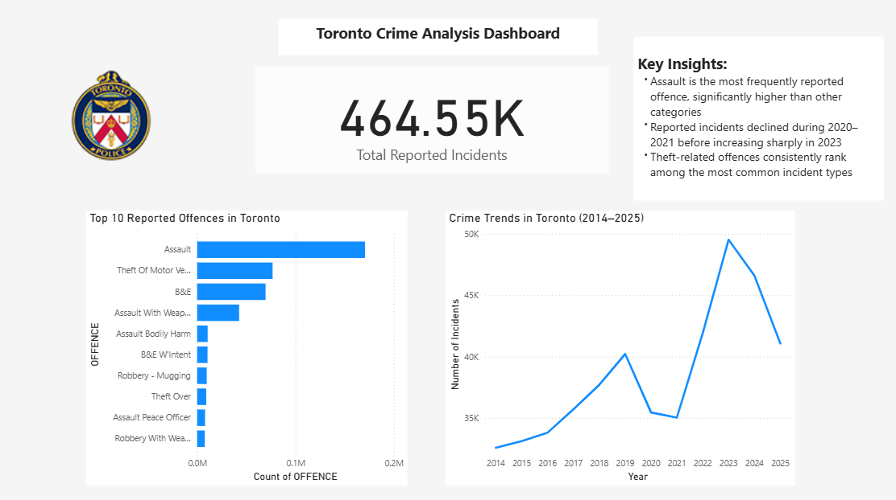

# Toronto Crime Analysis Dashboard 📊

## Overview
This Power BI dashboard analyzes crime trends and reported offences in Toronto from 2014 to 2025. The goal of this project was to identify patterns in crime activity and highlight key insights through data visualization.

## Key Insights
- Assault dominates all reported offence categories  
- Reported incidents declined during 2020–2021, followed by a sharp increase in 2023  
- Theft-related offences remain among the most common incident types  

## Tools Used
- Power BI  
- Excel  
- Data Visualization  

## Dashboard Preview

## Project File
- Toronto Crime Analysis Dashboard.pbix
